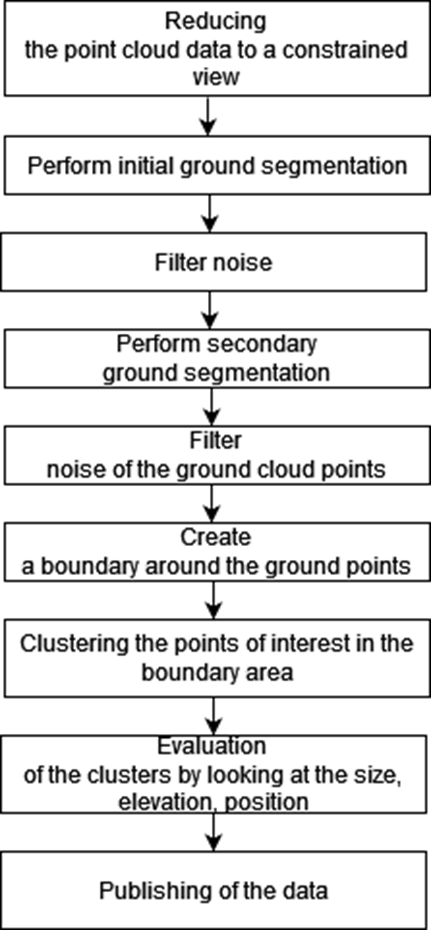

# Hackathon
This is a repo for the Hackathon Hack-the-car challenge. This project focuses on retrieving a 3d point cloud from the LiDAR sensor in order to predict bumps in front of the car.

## Team MINOS
Members: Artur, Yang, Ishan, Ayush, Matteo

## Table of Contents
1. [Setup](#setup)
2. [Structure](#structure)
3. [Result](#result)

## Setup
### Needed python libraries:
* open3d
* pointcloud2
* PIL
* numpy
* ecal

### Software & Interface
* eCAL
* Foxglove
* ecal-foxglove-bridge

### How to run
* for offline mode, you need to prepare recorded data file, start eCAL player and play the data
* for online mode, connect your PC to device to get real time data
* start eCAL monitor, topic names and message types are presented
* start Foxglove and ecal-foxglove-bridge
```shell
python ecal_foxglove_bridge
```
* run protobuf_rec.py to subscribe data and detect barriers and bumps on the road surface

## Structure
### Communication
The communication interface and data flow is shown as below:


### Algorithm
The following diagram describes the steps of retrieving obstacles (bumps) in front of the car. The algorithm is implemented in [bump_detection.py](bump_detection.py).

<div style="text-align: center; background: white; padding-top: 10px">
    
</div>


## Result
#### Foxglove visualization

<div style="align-content: center">
    
</div>

#### ground points segmentation

<div style="align-content: center">
    
</div>

#### point cloud clustering

<div style="align-content: center">
    
</div>

#### bump detection

<div style="align-content: center">
    
</div>


